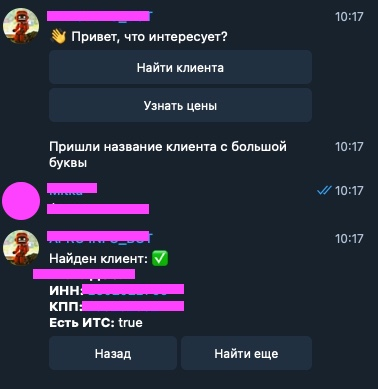
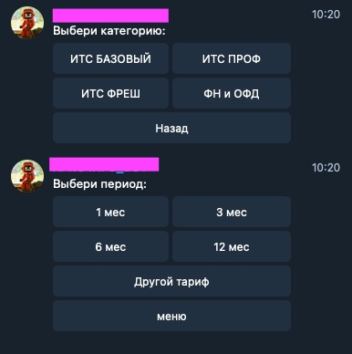
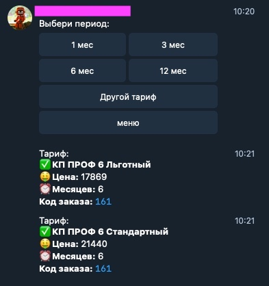

# Телеграм бот

Бот для внутреннего использования в организации-партнере "1С", для удобного поиска клиентов по базе данных, выводу основных реквизитов и контактов, а также для получения актуальной информации по тарифам предлагаемых услуг и сервисов по направлению информационно-технологического сопровождения 1С и контрольно-кассовой техники.

Сделан с использованием:

* [Node-telegram-bot-api](https://github.com/yagop/node-telegram-bot-api)
* [Express](https://expressjs.com/ru/)
* [PostgreSQL](https://www.postgresql.org)
* [Sequelize](https://sequelize.org)

---

### Реализованные функции:
* Поиск по наименованию клиента
* Поиск по наименованию тарифа, с учетом его периода
* Результат поиска с возможностью быстрого копирования информации в буфер обмена
* Ограничение доступа к боту для определенных пользователей телеграм.
### Функции на стадии разработки:
* Поиск по наименованию клиента независимо от регистра
* Инлайн режим работы с ботом
* Функция вывода только контактной информации клиента
* Подключение к трекеру Youtrack для возможности формирования тикета непосредственно из чата с ботом
* Добавление нового клиента в БД
* Переход на работу на свой рабочий сервер в организации и использование webhook

### Установка:
-npm install
#### Запуск:
-npm run start — запускает сервер c ботом.

-npm run dev - запуск сервера с hotreload

---

---

